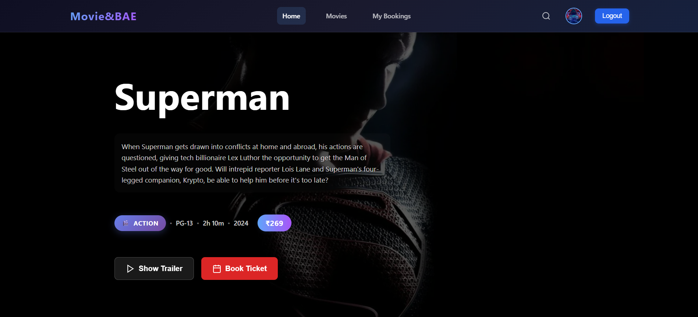

# Prince Goyal's Portfolio 2.0



A visually dynamic, interactive React-based portfolio website featuring animated backgrounds, smooth transitions, and a showcase of skills, education, and projects.

## Features
- Animated backgrounds (day, night, evening, morning)
- Hero landing section with animated typing and UFO
- Smooth page transitions using Framer Motion
- Toggle between Education and Skills with a floating button
- Projects timeline with images and links
- Contact form with email integration
- Fully responsive and modern UI

## Tech Stack
- React.js
- Framer Motion (for animations)
- React Router DOM (for routing)
- Custom SVG and CSS animations
- Modern CSS (flex, grid, gradients, blur, etc.)

## Getting Started

1. **Clone the repository:**
   ```sh
   git clone https://github.com/i-amprince/PortFolio_2.0.git
   ```
2. **Install dependencies:**
   ```sh
   npm install
   ```
3. **Start the development server:**
   ```sh
   npm start
   ```
4. **Open in browser:**
   Visit [http://localhost:3000](http://localhost:3000)

## Customization
- Update your details in `src/Section/AboutMe.js`, `Education.js`, `Skills.js`, and `Project.js`.
- Replace images in `src/Images/` as needed.
- Tweak colors and backgrounds in the CSS files for a personalized look.

## License
This project is open source and available under the MIT License.
